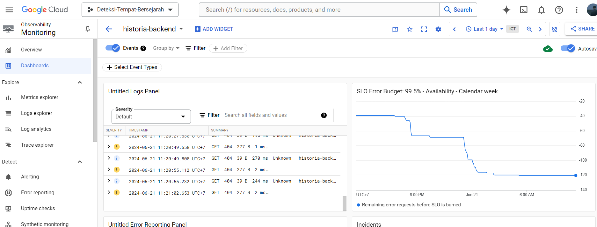
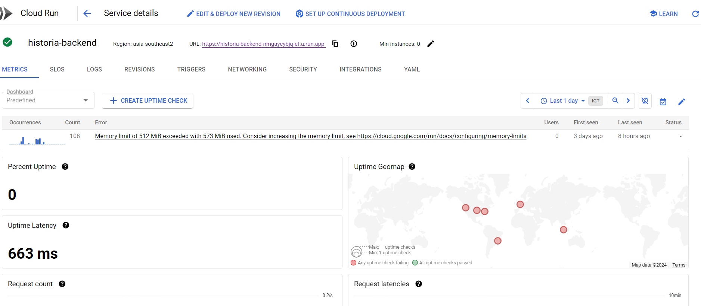
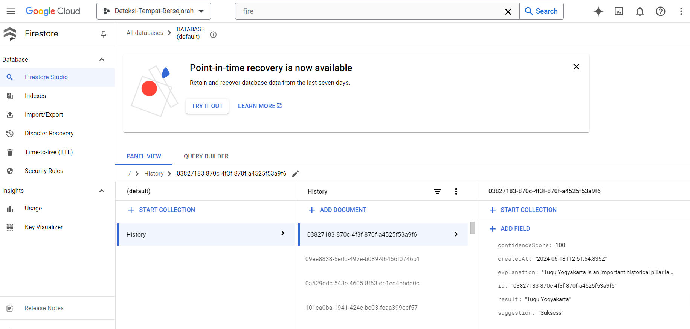
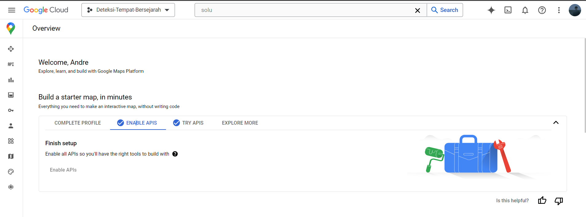

# HISTORIA

## Overview

The objective of this project is to teach and improve the knowledge of childrens and people by creating a history learning program in everyday life, leveraging machine learning, mobile development, and cloud computing technologies. Specifically, the project aims to evaluate the effectiveness of the program in teaching historic knowledge.

## Key Features

* **Location-Based Search:** Utilizes the user's real-time location to find relevant historical sites.
* **Detailed Information:** Provides comprehensive information about each site, including name, description, and images.
* **Interactive Map:** Displays an interactive map with markers indicating the locations of the historical sites.
* **Efficient Backend:** Employs Cloud Run for a serverless and scalable backend service.

## Technologies Used

* **Frontend:** [Mobile Development]
* **Backend:**
    * **Cloud Run:** Handles API requests, data processing, and communication with other services.
    * **Firestore:** Stores data about historical places.
    * **Places API:** Fetches additional information about places from Google's database.
* **Mapping:** Maps JavaScript API for map visualization.

## Setup Instructions

1. **Prerequisites:**
   * Active Google Cloud Platform project with billing enabled.
   * API key for Google Places API.

3. **Backend Deployment:**
   * Deploy the Cloud Run service using the provided Docker image.
   * Set environment variables for the Places API key and Firestore credentials.
     
Here are some attached photos of the services we use on Google Cloud Platform.

**Monitoring:** Collect and visualize key metrics related to our application's resource usage, request latency, and error rates.

**Cloud Run:** Handles API requests, data processing, and communication with other services.

**Firestore:** Stores data about historical places.

**Google Places API** to locate the the position of the searched places

